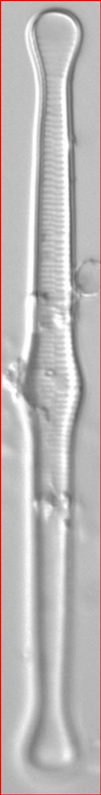

### 1.背景意义

研究背景与意义

硅藻（Diatoms）作为一种重要的微型藻类，广泛分布于全球的水体中，具有极高的生态和经济价值。它们不仅是水体食物链的基础，还在全球碳循环中扮演着关键角色。硅藻的多样性和丰富的种类使其在生态监测、环境评估以及水质管理中成为重要的指示生物。然而，传统的硅藻分类方法依赖于显微镜观察和人工鉴定，效率低下且容易受到人为因素的影响。因此，开发一种高效、准确的硅藻分类识别系统显得尤为重要。

近年来，深度学习技术的迅猛发展为计算机视觉领域带来了新的机遇，尤其是在物体检测和分类任务中。YOLO（You Only Look Once）系列模型以其快速和高效的特性，成为目标检测领域的热门选择。针对硅藻的特征和分类需求，基于改进YOLOv11的硅藻分类识别系统应运而生。该系统利用大规模的硅藻图像数据集（包含5904张图像和45个类别），能够实现对硅藻种类的自动识别和分类，从而提高分类的准确性和效率。

本研究的意义在于，不仅为生态学研究提供了一种新的工具，还能推动水质监测和环境保护的进程。通过对硅藻的自动化识别，相关机构能够更快速地获取水体生态信息，从而及时采取相应的环境保护措施。此外，该系统的成功应用还将为其他生物的自动分类提供借鉴，推动生物多样性研究和生态监测技术的发展。因此，基于改进YOLOv11的硅藻分类识别系统不仅具有重要的学术价值，还有助于实际应用中的生态保护和资源管理。

### 2.视频效果

[2.1 视频效果](https://www.bilibili.com/video/BV1EhUrYCEbY/)

### 3.图片效果


##### [项目涉及的源码数据来源链接](https://kdocs.cn/l/cszuIiCKVNis)**

注意：本项目提供训练的数据集和训练教程,由于版本持续更新,暂不提供权重文件（best.pt）,请按照6.训练教程进行训练后实现上图演示的效果。

### 4.数据集信息

##### 4.1 本项目数据集类别数＆类别名

nc: 45
names: ['Achnanthidium', 'Adlafia', 'Amphora', 'Aulacoseira', 'Brachysira', 'Caloneis', 'Cavinula', 'Chamaepinnularia', 'Cocconeis', 'Craticula', 'Cyclotella', 'Cymbopleura', 'Diadesmis', 'Diatoma', 'Encyonema', 'Encyonopsis', 'Eolimna', 'Eunotia', 'Fragilaria', 'Frustulia', 'Geissleria', 'Gomphonema', 'Hantzschia', 'Luticola', 'Mayamaea', 'Meridion', 'Navicula', 'Naviculadicta', 'Neidiopsis', 'Neidium', 'Nitzschia', 'Pinnularia', 'Planothidium', 'Psammothidium', 'Pseudostaurosira', 'Rossithidium', 'Sellaphora', 'Stauroforma', 'Stauroneis', 'Staurosira', 'Staurosirella', 'Stenopterobia', 'Stephanodiscus', 'Surirella', 'Tabellaria']


该项目为【目标检测】数据集，请在【训练教程和Web端加载模型教程（第三步）】这一步的时候按照【目标检测】部分的教程来训练

##### 4.2 本项目数据集信息介绍

本项目数据集信息介绍

本项目所使用的数据集为“Diatoms Dataset”，旨在支持改进YOLOv11的硅藻分类识别系统的训练与评估。该数据集包含45个不同的硅藻类别，涵盖了丰富的硅藻多样性，为研究人员提供了一个全面的分类基础。具体类别包括Achnanthidium、Adlafia、Amphora、Aulacoseira、Brachysira、Caloneis、Cavinula、Chamaepinnularia、Cocconeis、Craticula、Cyclotella、Cymbopleura、Diadesmis、Diatoma、Encyonema、Encyonopsis、Eolimna、Eunotia、Fragilaria、Frustulia、Geissleria、Gomphonema、Hantzschia、Luticola、Mayamaea、Meridion、Navicula、Naviculadicta、Neidiopsis、Neidium、Nitzschia、Pinnularia、Planothidium、Psammothidium、Pseudostaurosira、Rossithidium、Sellaphora、Stauroforma、Stauroneis、Staurosira、Staurosirella、Stenopterobia、Stephanodiscus、Surirella和Tabellaria等。

数据集中的每个类别均包含大量的图像样本，这些样本经过精心挑选和标注，以确保高质量的训练数据。每个类别的图像在拍摄时均考虑了不同的环境因素和光照条件，力求反映出硅藻在自然环境中的真实特征。这种多样性不仅增强了模型的泛化能力，也为后续的研究提供了更为广泛的基础。

通过使用该数据集，研究人员能够有效地训练和优化YOLOv11模型，使其在硅藻分类任务中表现出色。该数据集的设计旨在促进深度学习技术在生态学和生物多样性研究中的应用，推动相关领域的科学进步与发展。数据集的丰富性和多样性将为硅藻的自动识别与分类提供坚实的基础，助力于生态监测和环境保护等重要应用。




### 5.全套项目环境部署视频教程（零基础手把手教学）

[5.1 所需软件PyCharm和Anaconda安装教程（第一步）](https://www.bilibili.com/video/BV1BoC1YCEKi/?spm_id_from=333.999.0.0&vd_source=bc9aec86d164b67a7004b996143742dc)


[5.2 安装Python虚拟环境创建和依赖库安装视频教程（第二步）](https://www.bilibili.com/video/BV1ZoC1YCEBw?spm_id_from=333.788.videopod.sections&vd_source=bc9aec86d164b67a7004b996143742dc)

### 6.改进YOLOv11训练教程和Web_UI前端加载模型教程（零基础手把手教学）

[6.1 改进YOLOv11训练教程和Web_UI前端加载模型教程（第三步）](https://www.bilibili.com/video/BV1BoC1YCEhR?spm_id_from=333.788.videopod.sections&vd_source=bc9aec86d164b67a7004b996143742dc)


按照上面的训练视频教程链接加载项目提供的数据集，运行train.py即可开始训练



     Epoch   gpu_mem       box       obj       cls    labels  img_size
     1/200     20.8G   0.01576   0.01955  0.007536        22      1280: 100%|██████████| 849/849 [14:42<00:00,  1.04s/it]
               Class     Images     Labels          P          R     mAP@.5 mAP@.5:.95: 100%|██████████| 213/213 [01:14<00:00,  2.87it/s]
                 all       3395      17314      0.994      0.957      0.0957      0.0843

     Epoch   gpu_mem       box       obj       cls    labels  img_size
     2/200     20.8G   0.01578   0.01923  0.007006        22      1280: 100%|██████████| 849/849 [14:44<00:00,  1.04s/it]
               Class     Images     Labels          P          R     mAP@.5 mAP@.5:.95: 100%|██████████| 213/213 [01:12<00:00,  2.95it/s]
                 all       3395      17314      0.996      0.956      0.0957      0.0845

     Epoch   gpu_mem       box       obj       cls    labels  img_size
     3/200     20.8G   0.01561    0.0191  0.006895        27      1280: 100%|██████████| 849/849 [10:56<00:00,  1.29it/s]
               Class     Images     Labels          P          R     mAP@.5 mAP@.5:.95: 100%|███████   | 187/213 [00:52<00:00,  4.04it/s]
                 all       3395      17314      0.996      0.957      0.0957      0.0845


###### [项目数据集下载链接](https://kdocs.cn/l/cszuIiCKVNis)

### 7.原始YOLOv11算法讲解

YOLO11采用改进的骨干和颈部架构，增强了特征提取能力，提高了物体检测的精确度和复杂任务的表现。YOLO11引入精炼的架构设计和优化的训练流程，实现更快的处理速度，同时保持精度和性能之间的最佳平衡。通过模型设计的进步，YOLO11m在COCO数据集上实现了更高的均值平均精度（mAP），同时使用比YOLOv8m少22%的参数，使其在不妥协准确性的情况下更加计算高效。YOLO11可以无缝部署在各种环境中，包括边缘设备、云平台以及支持NVIDIA
GPU的系统，确保最大灵活性。无论是物体检测、实例分割、图像分类、姿态估计，还是定向物体检测（OBB），YOLO11都旨在应对多样的计算机视觉挑战。


##### **Ultralytics YOLO11相比于之前版本的主要改进有哪些？**

Ultralytics YOLO11在其前身基础上引入了几项重要进步。主要改进包括：

  1. **增强的特征提取** ：YOLO11采用改进的骨干和颈部架构，增强了特征提取能力，提高了物体检测的精确度。
  2.  **优化的效率和速度** ：精炼的架构设计和优化的训练流程实现了更快的处理速度，同时保持了准确性和性能之间的平衡。
  3.  **更高的准确性与更少的参数** ：YOLO11m在COCO数据集上实现了更高的均值平均精度（mAP），同时使用比YOLOv8m少22%的参数，使其在不妥协准确性的情况下更加计算高效。
  4.  **环境适应性强** ：YOLO11可以在多种环境中部署，包括边缘设备、云平台以及支持NVIDIA GPU的系统。
  5.  **支持广泛的任务** ：YOLO11支持多种计算机视觉任务，如物体检测、实例分割、图像分类、姿态估计和定向物体检测（OBB）。

我们先来看一下其网络结构有什么变化，可以看出，相比较于YOLOv8模型，其将CF2模块改成C3K2，同时在SPPF模块后面添加了一个C2PSA模块，且将YOLOv10的head思想引入到YOLO11的head中，使用深度可分离的方法，减少冗余计算，提高效率。下面我们来详细看一下这两个模块的结构是怎么构成的，以及它们为什么要这样设计


##### C3K2的网络结构

从下面图中我们可以看到，C3K2模块其实就是C2F模块转变出来的，它代码中有一个设置，就是当c3k这个参数为FALSE的时候，C3K2模块就是C2F模块，也就是说它的Bottleneck是普通的Bottleneck；反之当它为true的时候，将Bottleneck模块替换成C3模块。


##### C2PSA的网络结构

` `C2PSA是对 `C2f` 模块的扩展，它结合了PSA(Pointwise Spatial
Attention)块，用于增强特征提取和注意力机制。通过在标准 `C2f` 模块中引入 PSA
块，C2PSA实现了更强大的注意力机制，从而提高了模型对重要特征的捕捉能力。


##### **C2f 模块回顾：**

**** C2f模块是一个更快的 CSP（Cross Stage Partial）瓶颈实现，它通过两个卷积层和多个 Bottleneck
块进行特征提取。相比传统的 CSPNet，C2f 优化了瓶颈层的结构，使得计算速度更快。在 C2f中，`cv1` 是第一个 1x1
卷积，用于减少通道数；`cv2` 是另一个 1x1 卷积，用于恢复输出通道数。而 `n` 是一个包含 Bottleneck 块的数量，用于提取特征。

##### **C2PSA 模块的增强** ：

**C2PSA** 扩展了 C2f，通过引入PSA( **Position-Sensitive Attention)**
，旨在通过多头注意力机制和前馈神经网络来增强特征提取能力。它可以选择性地添加残差结构（shortcut）以优化梯度传播和网络训练效果。同时，使用FFN
可以将输入特征映射到更高维的空间，捕获输入特征的复杂非线性关系，允许模型学习更丰富的特征表示。

##### head部分

YOLO11在head部分的cls分支上使用深度可分离卷积 ，具体代码如下，cv2边界框回归分支，cv3分类分支。

    
    
     self.cv2 = nn.ModuleList(
                nn.Sequential(Conv(x, c2, 3), Conv(c2, c2, 3), nn.Conv2d(c2, 4 * self.reg_max, 1)) for x in ch
            )
            self.cv3 = nn.ModuleList(
                nn.Sequential(
                    nn.Sequential(DWConv(x, x, 3), Conv(x, c3, 1)),
                    nn.Sequential(DWConv(c3, c3, 3), Conv(c3, c3, 1)),
                    nn.Conv2d(c3, self.nc, 1),
                )
                for x in ch
            )


### 8.200+种全套改进YOLOV11创新点原理讲解

#### 8.1 200+种全套改进YOLOV11创新点原理讲解大全

由于篇幅限制，每个创新点的具体原理讲解就不全部展开，具体见下列网址中的改进模块对应项目的技术原理博客网址【Blog】（创新点均为模块化搭建，原理适配YOLOv5~YOLOv11等各种版本）

[改进模块技术原理博客【Blog】网址链接](https://gitee.com/qunmasj/good)


#### 8.2 精选部分改进YOLOV11创新点原理讲解

###### 这里节选部分改进创新点展开原理讲解(完整的改进原理见上图和[改进模块技术原理博客链接](https://gitee.com/qunmasj/good)【如果此小节的图加载失败可以通过CSDN或者Github搜索该博客的标题访问原始博客，原始博客图片显示正常】

### RT-DETR骨干网络HGNetv2简介
#### RT-DETR横空出世
前几天被百度的RT-DETR刷屏，参考该博客提出的目标检测新范式对原始DETR的网络结构进行了调整和优化，以提高计算速度和减小模型大小。这包括使用更轻量级的基础网络和调整Transformer结构。并且，摒弃了nms处理的detr结构与传统的物体检测方法相比，不仅训练是端到端的，检测也能端到端，这意味着整个网络在训练过程中一起进行优化，推理过程不需要昂贵的后处理代价，这有助于提高模型的泛化能力和性能。


当然，人们对RT-DETR之所以产生浓厚的兴趣，我觉得大概率还是对YOLO系列审美疲劳了，就算是出到了YOLO10086，我还是只想用YOLOv11和YOLOv11的框架来魔改做业务。。

#### 初识HGNet
看到RT-DETR的性能指标，发现指标最好的两个模型backbone都是用的HGNetv2，毫无疑问，和当时的picodet一样，骨干都是使用百度自家的网络。初识HGNet的时候，当时是参加了第四届百度网盘图像处理大赛，文档图像方向识别专题赛道，简单来说，就是使用分类网络对一些文档截图或者图片进行方向角度分类。


当时的方案并没有那么快定型，通常是打榜过程发现哪个网络性能好就使用哪个网络做魔改，而且木有显卡，只能蹭Ai Studio的平台，不过v100一天8小时的实验时间有点短，这也注定了大模型用不了。 

流水的模型，铁打的炼丹人，最后发现HGNet-tiny各方面指标都很符合我们的预期，后面就一直围绕它魔改。当然，比赛打榜是目的，学习才是享受过程，当时看到效果还可以，便开始折腾起了HGNet的网络架构，我们可以看到，PP-HGNet 针对 GPU 设备，对目前 GPU 友好的网络做了分析和归纳，尽可能多的使用 3x3 标准卷积（计算密度最高），PP-HGNet是由多个HG-Block组成，细节如下：


ConvBNAct是啥？简单聊一聊，就是Conv+BN+Act，CV Man应该最熟悉不过了：
```python
class ConvBNAct(TheseusLayer):
    def __init__(self,
                 in_channels,
                 out_channels,
                 kernel_size,
                 stride,
                 groups=1,
                 use_act=True):
        super().__init__()
        self.use_act = use_act
        self.conv = Conv2D(
            in_channels,
            out_channels,
            kernel_size,
            stride,
            padding=(kernel_size - 1) // 2,
            groups=groups,
            bias_attr=False)
        self.bn = BatchNorm2D(
            out_channels,
            weight_attr=ParamAttr(regularizer=L2Decay(0.0)),
            bias_attr=ParamAttr(regularizer=L2Decay(0.0)))
        if self.use_act:
            self.act = ReLU()
 
    def forward(self, x):
        x = self.conv(x)
        x = self.bn(x)
        if self.use_act:
            x = self.act(x)
        return x 
```
且标准卷积的数量随层数深度增加而增多，从而得到一个有利于 GPU 推理的骨干网络，同样速度下，精度也超越其他 CNN ，性价比也优于ViT-base模型。


另外，我们可以看到：

PP-HGNet 的第一层由channel为96的Stem模块构成，目的是为了减少参数量和计算量。PP-HGNet

Tiny的整体结构由四个HG Stage构成，而每个HG Stage主要由包含大量标准卷积的HG Block构成。

PP-HGNet的第三到第五层使用了使用了可学习的下采样层（LDS Layer），该层group为输入通道数，可达到降参降计算量的作用，且Tiny模型仅包含三个LDS Layer，并不会对GPU的利用率造成较大影响.

PP-HGNet的激活函数为Relu，常数级操作可保证该模型在硬件上的推理速度。

### 9.系统功能展示

图9.1.系统支持检测结果表格显示

  图9.2.系统支持置信度和IOU阈值手动调节

  图9.3.系统支持自定义加载权重文件best.pt(需要你通过步骤5中训练获得)

  图9.4.系统支持摄像头实时识别

  图9.5.系统支持图片识别

  图9.6.系统支持视频识别

  图9.7.系统支持识别结果文件自动保存

  图9.8.系统支持Excel导出检测结果数据


### 10. YOLOv11核心改进源码讲解

#### 10.1 mamba_yolo.py

以下是代码中最核心的部分，并附上详细的中文注释：

```python
import torch
import torch.nn as nn
from einops import rearrange

class LayerNorm2d(nn.Module):
    """自定义的二维层归一化类"""
    def __init__(self, normalized_shape, eps=1e-6, elementwise_affine=True):
        super().__init__()
        self.norm = nn.LayerNorm(normalized_shape, eps, elementwise_affine)

    def forward(self, x):
        # 将输入的形状从 (B, C, H, W) 转换为 (B, H, W, C)
        x = rearrange(x, 'b c h w -> b h w c').contiguous()
        x = self.norm(x)  # 应用层归一化
        # 将形状转换回 (B, C, H, W)
        x = rearrange(x, 'b h w c -> b c h w').contiguous()
        return x

class CrossScan(torch.autograd.Function):
    """交叉扫描操作"""
    @staticmethod
    def forward(ctx, x: torch.Tensor):
        B, C, H, W = x.shape
        ctx.shape = (B, C, H, W)
        xs = x.new_empty((B, 4, C, H * W))  # 创建新的张量用于存储交叉扫描结果
        xs[:, 0] = x.flatten(2, 3)  # 将输入展平
        xs[:, 1] = x.transpose(dim0=2, dim1=3).flatten(2, 3)  # 转置并展平
        xs[:, 2:4] = torch.flip(xs[:, 0:2], dims=[-1])  # 反转前两个维度
        return xs

    @staticmethod
    def backward(ctx, ys: torch.Tensor):
        B, C, H, W = ctx.shape
        L = H * W
        # 计算反向传播的梯度
        ys = ys[:, 0:2] + ys[:, 2:4].flip(dims=[-1]).view(B, 2, -1, L)
        y = ys[:, 0] + ys[:, 1].view(B, -1, W, H).transpose(dim0=2, dim1=3).contiguous().view(B, -1, L)
        return y.view(B, -1, H, W)

class SelectiveScanCore(torch.autograd.Function):
    """选择性扫描核心操作"""
    @staticmethod
    @torch.cuda.amp.custom_fwd
    def forward(ctx, u, delta, A, B, C, D=None, delta_bias=None, delta_softplus=False, nrows=1, backnrows=1, oflex=True):
        # 确保输入张量是连续的
        if u.stride(-1) != 1:
            u = u.contiguous()
        if delta.stride(-1) != 1:
            delta = delta.contiguous()
        if D is not None and D.stride(-1) != 1:
            D = D.contiguous()
        if B.stride(-1) != 1:
            B = B.contiguous()
        if C.stride(-1) != 1:
            C = C.contiguous()
        
        # 处理输入的维度
        if B.dim() == 3:
            B = B.unsqueeze(dim=1)
            ctx.squeeze_B = True
        if C.dim() == 3:
            C = C.unsqueeze(dim=1)
            ctx.squeeze_C = True
        
        ctx.delta_softplus = delta_softplus
        ctx.backnrows = backnrows
        
        # 调用CUDA核心进行前向计算
        out, x, *rest = selective_scan_cuda_core.fwd(u, delta, A, B, C, D, delta_bias, delta_softplus, 1)
        ctx.save_for_backward(u, delta, A, B, C, D, delta_bias, x)  # 保存用于反向传播的张量
        return out

    @staticmethod
    @torch.cuda.amp.custom_bwd
    def backward(ctx, dout, *args):
        u, delta, A, B, C, D, delta_bias, x = ctx.saved_tensors
        if dout.stride(-1) != 1:
            dout = dout.contiguous()
        # 调用CUDA核心进行反向计算
        du, ddelta, dA, dB, dC, dD, ddelta_bias, *rest = selective_scan_cuda_core.bwd(
            u, delta, A, B, C, D, delta_bias, dout, x, ctx.delta_softplus, 1
        )
        return (du, ddelta, dA, dB, dC, dD, ddelta_bias, None, None, None, None)

def cross_selective_scan(x: torch.Tensor, x_proj_weight: torch.Tensor, x_proj_bias: torch.Tensor, dt_projs_weight: torch.Tensor, dt_projs_bias: torch.Tensor, A_logs: torch.Tensor, Ds: torch.Tensor, out_norm: torch.nn.Module = None, out_norm_shape="v0", nrows=-1, backnrows=-1, delta_softplus=True, to_dtype=True, force_fp32=False, ssoflex=True, SelectiveScan=None):
    """交叉选择性扫描操作"""
    B, D, H, W = x.shape
    D, N = A_logs.shape
    K, D, R = dt_projs_weight.shape
    L = H * W

    def selective_scan(u, delta, A, B, C, D=None, delta_bias=None, delta_softplus=True):
        return SelectiveScan.apply(u, delta, A, B, C, D, delta_bias, delta_softplus, nrows, backnrows, ssoflex)

    xs = CrossScan.apply(x)  # 进行交叉扫描

    # 进行张量的乘法和偏置处理
    x_dbl = torch.einsum("b k d l, k c d -> b k c l", xs, x_proj_weight)
    if x_proj_bias is not None:
        x_dbl = x_dbl + x_proj_bias.view(1, K, -1, 1)
    
    # 分割张量
    dts, Bs, Cs = torch.split(x_dbl, [R, N, N], dim=2)
    dts = torch.einsum("b k r l, k d r -> b k d l", dts, dt_projs_weight)
    xs = xs.view(B, -1, L)
    dts = dts.contiguous().view(B, -1, L)

    # HiPPO矩阵
    As = -torch.exp(A_logs.to(torch.float))  # 计算A矩阵
    Bs = Bs.contiguous()
    Cs = Cs.contiguous()
    Ds = Ds.to(torch.float)  # 将Ds转换为浮点数
    delta_bias = dt_projs_bias.view(-1).to(torch.float)

    # 选择性扫描
    ys: torch.Tensor = selective_scan(xs, dts, As, Bs, Cs, Ds, delta_bias, delta_softplus).view(B, K, -1, H, W)

    # 进行交叉合并
    y: torch.Tensor = CrossMerge.apply(ys)

    # 进行输出归一化
    if out_norm_shape in ["v1"]:
        y = out_norm(y.view(B, -1, H, W)).permute(0, 2, 3, 1)
    else:
        y = y.transpose(dim0=1, dim1=2).contiguous()
        y = out_norm(y).view(B, H, W, -1)

    return (y.to(x.dtype) if to_dtype else y)

class SS2D(nn.Module):
    """选择性扫描2D模块"""
    def __init__(self, d_model=96, d_state=16, ssm_ratio=2.0, ssm_rank_ratio=2.0, dt_rank="auto", act_layer=nn.SiLU, d_conv=3, conv_bias=True, dropout=0.0, bias=False, forward_type="v2", **kwargs):
        super().__init__()
        d_expand = int(ssm_ratio * d_model)  # 扩展维度
        d_inner = int(min(ssm_rank_ratio, ssm_ratio) * d_model) if ssm_rank_ratio > 0 else d_expand
        self.dt_rank = math.ceil(d_model / 16) if dt_rank == "auto" else dt_rank
        self.d_state = math.ceil(d_model / 6) if d_state == "auto" else d_state  # 20240109
        self.d_conv = d_conv
        self.K = 4

        # 输入投影
        d_proj = d_expand if self.disable_z else (d_expand * 2)
        self.in_proj = nn.Conv2d(d_model, d_proj, kernel_size=1, stride=1, groups=1, bias=bias, **kwargs)
        self.act: nn.Module = nn.GELU()

        # 卷积层
        if self.d_conv > 1:
            self.conv2d = nn.Conv2d(
                in_channels=d_expand,
                out_channels=d_expand,
                groups=d_expand,
                bias=conv_bias,
                kernel_size=d_conv,
                padding=(d_conv - 1) // 2,
                **kwargs,
            )

        # 低秩处理
        self.ssm_low_rank = False
        if d_inner < d_expand:
            self.ssm_low_rank = True
            self.in_rank = nn.Conv2d(d_expand, d_inner, kernel_size=1, bias=False, **kwargs)
            self.out_rank = nn.Linear(d_inner, d_expand, bias=False, **kwargs)

        # 输出投影
        self.out_proj = nn.Conv2d(d_expand, d_model, kernel_size=1, stride=1, bias=bias, **kwargs)
        self.dropout = nn.Dropout(dropout) if dropout > 0. else nn.Identity()

        # 初始化参数
        self.Ds = nn.Parameter(torch.ones((self.K * d_inner)))
        self.A_logs = nn.Parameter(torch.zeros((self.K * d_inner, self.d_state)))  # A == -A_logs.exp() < 0
        self.dt_projs_weight = nn.Parameter(torch.randn((self.K, d_inner, self.dt_rank)))
        self.dt_projs_bias = nn.Parameter(torch.randn((self.K, d_inner)))

    def forward_corev2(self, x: torch.Tensor, channel_first=False, SelectiveScan=SelectiveScanCore, cross_selective_scan=cross_selective_scan, force_fp32=None):
        if not channel_first:
            x = x.permute(0, 3, 1, 2).contiguous()
        if self.ssm_low_rank:
            x = self.in_rank(x)
        x = cross_selective_scan(
            x, self.x_proj_weight, None, self.dt_projs_weight, self.dt_projs_bias,
            self.A_logs, self.Ds,
            out_norm=getattr(self, "out_norm", None),
            out_norm_shape=getattr(self, "out_norm_shape", "v0"),
            delta_softplus=True, force_fp32=force_fp32,
            SelectiveScan=SelectiveScan, ssoflex=self.training,
        )
        if self.ssm_low_rank:
            x = self.out_rank(x)
        return x

    def forward(self, x: torch.Tensor, **kwargs):
        x = self.in_proj(x)  # 输入投影
        if not self.disable_z:
            x, z = x.chunk(2, dim=1)  # 分割
            if not self.disable_z_act:
                z1 = self.act(z)
        if self.d_conv > 0:
            x = self.conv2d(x)  # 卷积操作
        x = self.act(x)
        y = self.forward_core(x, channel_first=(self.d_conv > 1))  # 核心前向计算
        y = y.permute(0, 3, 1, 2).contiguous()  # 转换维度
        if not self.disable_z:
            y = y * z1  # 结合z
        out = self.dropout(self.out_proj(y))  # 输出投影
        return out

class VSSBlock_YOLO(nn.Module):
    """YOLO模型中的选择性扫描块"""
    def __init__(self, in_channels: int = 0, hidden_dim: int = 0, drop_path: float = 0, norm_layer: Callable[..., torch.nn.Module] = partial(LayerNorm2d, eps=1e-6), ssm_d_state: int = 16, ssm_ratio=2.0, ssm_rank_ratio=2.0, ssm_dt_rank: Any = "auto", ssm_act_layer=nn.SiLU, ssm_conv: int = 3, ssm_conv_bias=True, ssm_drop_rate: float = 0, forward_type="v2", **kwargs):
        super().__init__()
        self.proj_conv = nn.Sequential(
            nn.Conv2d(in_channels, hidden_dim, kernel_size=1, stride=1, padding=0, bias=True),
            nn.BatchNorm2d(hidden_dim),
            nn.SiLU()
        )

        self.norm = norm_layer(hidden_dim)
        self.op = SS2D(
            d_model=hidden_dim,
            d_state=ssm_d_state,
            ssm_ratio=ssm_ratio,
            ssm_rank_ratio=ssm_rank_ratio,
            dt_rank=ssm_dt_rank,
            act_layer=ssm_act_layer,
            d_conv=ssm_conv,
            conv_bias=ssm_conv_bias,
            dropout=ssm_drop_rate,
            forward_type=forward_type,
        )

        self.drop_path = DropPath(drop_path)
        self.lsblock = LSBlock(hidden_dim, hidden_dim)
        self.norm2 = norm_layer(hidden_dim)
        mlp_hidden_dim = int(hidden_dim * 4.0)  # MLP的隐藏维度
        self.mlp = RGBlock(in_features=hidden_dim, hidden_features=mlp_hidden_dim, act_layer=nn.GELU, drop=0.0)

    def forward(self, input: torch.Tensor):
        input = self.proj_conv(input)  # 投影
        X1 = self.lsblock(input)  # LSBlock
        x = input + self.drop_path(self.op(self.norm(X1)))  # 选择性扫描操作
        x = x + self.drop_path(self.mlp(self.norm2(x)))  # MLP操作
        return x
```

### 主要功能
1. **LayerNorm2d**: 实现了对二维数据的层归一化。
2. **CrossScan**: 实现了交叉扫描操作，用于生成不同方向的特征。
3. **SelectiveScanCore**: 核心选择性扫描操作，支持前向和反向传播。
4. **cross_selective_scan**: 结合多个输入张量进行选择性扫描的函数。
5. **SS2D**: 实现选择性扫描的2D模块，包含输入投影、卷积层和输出投影。
6. **VSSBlock_YOLO**: YOLO模型中的选择性扫描块，结合了投影、选择性扫描和MLP操作。

这些模块在计算机视觉任务中常用于特征提取和增强，特别是在目标检测和图像分割等应用中。

该文件 `mamba_yolo.py` 是一个用于实现 YOLO（You Only Look Once）目标检测模型的 PyTorch 代码，包含了一系列自定义的神经网络模块和功能。代码主要分为几个部分，下面将逐步分析。

首先，文件导入了一些必要的库，包括 PyTorch、数学库、类型提示以及一些特定的模块（如 `DropPath` 和 `selective_scan_cuda`）。这些导入为后续的模型构建和计算提供了基础。

接下来，定义了一个 `LayerNorm2d` 类，它是一个自定义的二维层归一化模块。这个模块在前向传播中将输入的张量从 (B, C, H, W) 的形状转换为 (B, H, W, C)，然后应用层归一化，最后再转换回原来的形状。这种归一化方式有助于加速训练并提高模型的稳定性。

`autopad` 函数用于自动计算卷积操作的填充量，以确保输出的形状与输入相同。它根据给定的卷积核大小和扩张率来计算填充。

`CrossScan` 和 `CrossMerge` 是两个自定义的 PyTorch 自动求导函数，分别用于实现交叉扫描和交叉合并操作。这些操作在模型中用于处理输入特征图，提取和合并信息。

`SelectiveScanCore` 类实现了选择性扫描的核心功能，支持前向和反向传播。选择性扫描是一种优化的计算方式，能够有效地处理高维数据并减少计算复杂度。

`cross_selective_scan` 函数则是对选择性扫描的封装，处理输入数据并进行一系列的张量操作，最终输出经过处理的特征图。

接下来的 `SS2D` 类是一个主要的模块，包含了多个重要的参数和结构，包括输入投影、卷积层、输出投影等。它实现了选择性扫描的功能，并在前向传播中应用了不同的操作，包括线性变换和卷积。

`RGBlock` 和 `LSBlock` 是两个基本的网络块，分别实现了特征的提取和处理。`RGBlock` 通过卷积和激活函数来处理输入特征，而 `LSBlock` 则通过多层卷积和归一化来增强特征。

`XSSBlock` 和 `VSSBlock_YOLO` 是更复杂的模块，结合了之前定义的各个组件，构成了 YOLO 模型的主要结构。这些模块通过不同的操作组合来提取特征，并在最后输出结果。

`SimpleStem` 和 `VisionClueMerge` 是用于特征提取和合并的辅助模块。`SimpleStem` 通过一系列卷积层将输入特征映射到更高维度，而 `VisionClueMerge` 则通过特定的方式合并特征图。

整体来看，该文件实现了一个复杂的神经网络结构，结合了选择性扫描、交叉合并等技术，旨在提高 YOLO 模型在目标检测任务中的性能。每个模块都经过精心设计，以便在不同的阶段对特征进行有效的处理和提取。

#### 10.2 lsknet.py

以下是代码中最核心的部分，并添加了详细的中文注释：

```python
import torch
import torch.nn as nn
from functools import partial

class Mlp(nn.Module):
    """多层感知机（MLP）模块"""
    def __init__(self, in_features, hidden_features=None, out_features=None, act_layer=nn.GELU, drop=0.):
        super().__init__()
        out_features = out_features or in_features  # 输出特征数
        hidden_features = hidden_features or in_features  # 隐藏层特征数
        self.fc1 = nn.Conv2d(in_features, hidden_features, 1)  # 第一个卷积层
        self.dwconv = DWConv(hidden_features)  # 深度卷积层
        self.act = act_layer()  # 激活函数
        self.fc2 = nn.Conv2d(hidden_features, out_features, 1)  # 第二个卷积层
        self.drop = nn.Dropout(drop)  # Dropout层

    def forward(self, x):
        x = self.fc1(x)  # 通过第一个卷积层
        x = self.dwconv(x)  # 通过深度卷积层
        x = self.act(x)  # 激活
        x = self.drop(x)  # Dropout
        x = self.fc2(x)  # 通过第二个卷积层
        x = self.drop(x)  # Dropout
        return x

class Attention(nn.Module):
    """注意力模块"""
    def __init__(self, d_model):
        super().__init__()
        self.proj_1 = nn.Conv2d(d_model, d_model, 1)  # 投影层1
        self.activation = nn.GELU()  # 激活函数
        self.spatial_gating_unit = LSKblock(d_model)  # 空间门控单元
        self.proj_2 = nn.Conv2d(d_model, d_model, 1)  # 投影层2

    def forward(self, x):
        shortcut = x.clone()  # 保存输入用于残差连接
        x = self.proj_1(x)  # 通过投影层1
        x = self.activation(x)  # 激活
        x = self.spatial_gating_unit(x)  # 通过空间门控单元
        x = self.proj_2(x)  # 通过投影层2
        x = x + shortcut  # 残差连接
        return x

class Block(nn.Module):
    """基本模块，包含注意力和MLP"""
    def __init__(self, dim, mlp_ratio=4., drop=0., drop_path=0., act_layer=nn.GELU):
        super().__init__()
        self.norm1 = nn.BatchNorm2d(dim)  # 第一层归一化
        self.norm2 = nn.BatchNorm2d(dim)  # 第二层归一化
        self.attn = Attention(dim)  # 注意力模块
        self.mlp = Mlp(in_features=dim, hidden_features=int(dim * mlp_ratio), act_layer=act_layer, drop=drop)  # MLP模块

    def forward(self, x):
        x = x + self.attn(self.norm1(x))  # 添加注意力模块的输出
        x = x + self.mlp(self.norm2(x))  # 添加MLP模块的输出
        return x

class LSKNet(nn.Module):
    """LSKNet网络结构"""
    def __init__(self, img_size=224, in_chans=3, embed_dims=[64, 128, 256, 512], depths=[3, 4, 6, 3]):
        super().__init__()
        self.num_stages = len(depths)  # 网络阶段数
        for i in range(self.num_stages):
            # 初始化每个阶段的Patch嵌入和块
            patch_embed = OverlapPatchEmbed(img_size=img_size // (2 ** i), in_chans=in_chans if i == 0 else embed_dims[i - 1], embed_dim=embed_dims[i])
            block = nn.ModuleList([Block(dim=embed_dims[i]) for _ in range(depths[i])])
            setattr(self, f"patch_embed{i + 1}", patch_embed)
            setattr(self, f"block{i + 1}", block)

    def forward(self, x):
        outs = []
        for i in range(self.num_stages):
            patch_embed = getattr(self, f"patch_embed{i + 1}")
            block = getattr(self, f"block{i + 1}")
            x, _, _ = patch_embed(x)  # 通过Patch嵌入
            for blk in block:
                x = blk(x)  # 通过每个块
            outs.append(x)  # 保存输出
        return outs

class DWConv(nn.Module):
    """深度卷积模块"""
    def __init__(self, dim=768):
        super(DWConv, self).__init__()
        self.dwconv = nn.Conv2d(dim, dim, 3, padding=1, groups=dim)  # 深度卷积

    def forward(self, x):
        return self.dwconv(x)  # 通过深度卷积

def lsknet_t(weights=''):
    """构建LSKNet_t模型"""
    model = LSKNet(embed_dims=[32, 64, 160, 256], depths=[3, 3, 5, 2])
    if weights:
        model.load_state_dict(torch.load(weights)['state_dict'])  # 加载权重
    return model

if __name__ == '__main__':
    model = lsknet_t('lsk_t_backbone-2ef8a593.pth')  # 创建模型实例
    inputs = torch.randn((1, 3, 640, 640))  # 随机输入
    for i in model(inputs):
        print(i.size())  # 输出每个阶段的输出尺寸
```

### 代码说明：
1. **Mlp**: 实现了一个多层感知机，包括两个卷积层和一个深度卷积层，使用GELU激活函数和Dropout。
2. **Attention**: 实现了一个注意力机制模块，包含两个投影层和一个空间门控单元。
3. **Block**: 组合了注意力模块和MLP模块，并使用BatchNorm进行归一化。
4. **LSKNet**: 主网络结构，包含多个阶段，每个阶段有Patch嵌入和多个Block。
5. **DWConv**: 实现了深度卷积，用于特征提取。
6. **lsknet_t**: 用于创建LSKNet_t模型并加载预训练权重。

通过这些核心模块的组合，构建了一个高效的深度学习模型，适用于图像处理任务。

这个程序文件 `lsknet.py` 实现了一个名为 LSKNet 的深度学习模型，主要用于图像处理任务。代码中使用了 PyTorch 框架，并定义了一系列的神经网络模块和功能。

首先，文件导入了必要的库，包括 PyTorch 的核心模块、神经网络模块、以及一些实用工具。接着，定义了几个主要的类，这些类构成了 LSKNet 模型的基础。

`Mlp` 类实现了一个多层感知机（MLP），它包含两个卷积层和一个深度可分离卷积（DWConv），并使用 GELU 激活函数和 Dropout 层来增强模型的表现。`LSKblock` 类则是一个特殊的块，包含了多种卷积操作，通过注意力机制来处理输入特征图，生成加权的输出。

`Attention` 类实现了一个注意力机制，结合了前面定义的 `LSKblock`，通过两个卷积层来处理输入数据，并将结果与输入进行相加，以增强特征的表达能力。

`Block` 类是 LSKNet 的基本构建模块，结合了归一化层、注意力层和 MLP。它使用了残差连接和可学习的缩放参数，以便在训练过程中调整特征的权重。

`OverlapPatchEmbed` 类负责将输入图像分割成重叠的补丁，并进行嵌入，生成特征图。这个过程包括卷积操作和归一化。

`LSKNet` 类是整个模型的核心，定义了模型的结构，包括不同阶段的嵌入、块和归一化层。模型的深度和宽度通过参数 `embed_dims` 和 `depths` 来控制，并且支持随机深度的训练策略。

`DWConv` 类实现了深度可分离卷积，用于在 `Mlp` 中进行特征提取。

`update_weight` 函数用于更新模型的权重，将预训练模型的权重加载到当前模型中。

最后，`lsknet_t` 和 `lsknet_s` 函数分别定义了两种不同配置的 LSKNet 模型，并支持加载预训练权重。在 `__main__` 块中，示例代码展示了如何实例化模型并进行前向传播，打印输出特征图的尺寸。

总体而言，这个文件实现了一个灵活且强大的图像处理模型，适用于各种计算机视觉任务。

#### 10.3 kaln_conv.py

以下是经过简化和注释的核心代码部分，保留了主要功能和结构：

```python
from functools import lru_cache
import torch
import torch.nn as nn
from torch.nn.functional import conv3d, conv2d, conv1d

class KALNConvNDLayer(nn.Module):
    def __init__(self, conv_class, norm_class, conv_w_fun, input_dim, output_dim, degree, kernel_size,
                 groups=1, padding=0, stride=1, dilation=1, dropout: float = 0.0, ndim: int = 2):
        super(KALNConvNDLayer, self).__init__()
        
        # 初始化参数
        self.inputdim = input_dim
        self.outdim = output_dim
        self.degree = degree
        self.kernel_size = kernel_size
        self.padding = padding
        self.stride = stride
        self.dilation = dilation
        self.groups = groups
        self.base_activation = nn.SiLU()  # 基础激活函数
        self.conv_w_fun = conv_w_fun  # 卷积权重函数
        self.ndim = ndim  # 维度
        self.dropout = nn.Dropout3d(p=dropout) if ndim == 3 else nn.Dropout2d(p=dropout) if ndim == 2 else nn.Dropout1d(p=dropout) if ndim == 1 else None

        # 检查参数有效性
        if groups <= 0 or input_dim % groups != 0 or output_dim % groups != 0:
            raise ValueError('groups must be a positive integer and input/output dimensions must be divisible by groups')

        # 创建基础卷积层和归一化层
        self.base_conv = nn.ModuleList([conv_class(input_dim // groups, output_dim // groups, kernel_size, stride, padding, dilation, groups=1, bias=False) for _ in range(groups)])
        self.layer_norm = nn.ModuleList([norm_class(output_dim // groups) for _ in range(groups)])

        # 多项式权重参数
        poly_shape = (groups, output_dim // groups, (input_dim // groups) * (degree + 1)) + tuple(kernel_size for _ in range(ndim))
        self.poly_weights = nn.Parameter(torch.randn(*poly_shape))

        # 权重初始化
        for conv_layer in self.base_conv:
            nn.init.kaiming_uniform_(conv_layer.weight, nonlinearity='linear')
        nn.init.kaiming_uniform_(self.poly_weights, nonlinearity='linear')

    @lru_cache(maxsize=128)  # 缓存以避免重复计算勒让德多项式
    def compute_legendre_polynomials(self, x, order):
        # 计算勒让德多项式
        P0 = x.new_ones(x.shape)  # P0 = 1
        if order == 0:
            return P0.unsqueeze(-1)
        P1 = x  # P1 = x
        legendre_polys = [P0, P1]

        # 使用递推关系计算更高阶的多项式
        for n in range(1, order):
            Pn = ((2.0 * n + 1.0) * x * legendre_polys[-1] - n * legendre_polys[-2]) / (n + 1.0)
            legendre_polys.append(Pn)

        return torch.concatenate(legendre_polys, dim=1)

    def forward_kal(self, x, group_index):
        # 前向传播，计算基础输出和多项式输出
        base_output = self.base_conv[group_index](x)

        # 归一化输入
        x_normalized = 2 * (x - x.min()) / (x.max() - x.min()) - 1 if x.shape[0] > 0 else x
        if self.dropout is not None:
            x_normalized = self.dropout(x_normalized)

        # 计算勒让德多项式
        legendre_basis = self.compute_legendre_polynomials(x_normalized, self.degree)
        poly_output = self.conv_w_fun(legendre_basis, self.poly_weights[group_index], stride=self.stride, dilation=self.dilation, padding=self.padding, groups=1)

        # 合并基础输出和多项式输出，归一化并激活
        x = base_output + poly_output
        x = self.layer_norm[group_index](x.view(x.shape[0], -1)).view(x.shape) if isinstance(self.layer_norm[group_index], nn.LayerNorm) else self.layer_norm[group_index](x)
        x = self.base_activation(x)

        return x

    def forward(self, x):
        # 前向传播，处理多个组
        split_x = torch.split(x, self.inputdim // self.groups, dim=1)
        output = [self.forward_kal(_x.clone(), group_ind) for group_ind, _x in enumerate(split_x)]
        return torch.cat(output, dim=1)

# 3D、2D、1D卷积层的具体实现
class KALNConv3DLayer(KALNConvNDLayer):
    def __init__(self, input_dim, output_dim, kernel_size, degree=3, groups=1, padding=0, stride=1, dilation=1, dropout: float = 0.0):
        super(KALNConv3DLayer, self).__init__(nn.Conv3d, nn.InstanceNorm3d, conv3d, input_dim, output_dim, degree, kernel_size, groups=groups, padding=padding, stride=stride, dilation=dilation, ndim=3, dropout=dropout)

class KALNConv2DLayer(KALNConvNDLayer):
    def __init__(self, input_dim, output_dim, kernel_size, degree=3, groups=1, padding=0, stride=1, dilation=1, dropout: float = 0.0, norm_layer=nn.InstanceNorm2d):
        super(KALNConv2DLayer, self).__init__(nn.Conv2d, norm_layer, conv2d, input_dim, output_dim, degree, kernel_size, groups=groups, padding=padding, stride=stride, dilation=dilation, ndim=2, dropout=dropout)

class KALNConv1DLayer(KALNConvNDLayer):
    def __init__(self, input_dim, output_dim, kernel_size, degree=3, groups=1, padding=0, stride=1, dilation=1, dropout: float = 0.0):
        super(KALNConv1DLayer, self).__init__(nn.Conv1d, nn.InstanceNorm1d, conv1d, input_dim, output_dim, degree, kernel_size, groups=groups, padding=padding, stride=stride, dilation=dilation, ndim=1, dropout=dropout)
```

### 代码注释说明：
1. **KALNConvNDLayer**: 这是一个通用的卷积层类，支持多维卷积（1D、2D、3D），并使用勒让德多项式进行特征变换。
2. **构造函数**: 初始化卷积层、归一化层和多项式权重，并进行参数有效性检查。
3. **compute_legendre_polynomials**: 计算勒让德多项式，使用递推关系生成多项式。
4. **forward_kal**: 处理单个组的前向传播，计算基础卷积输出和多项式输出，并进行归一化和激活。
5. **forward**: 处理输入的多个组，调用`forward_kal`进行计算，并将结果拼接在一起。
6. **KALNConv3DLayer、KALNConv2DLayer、KALNConv1DLayer**: 这三个类分别实现了3D、2D和1D卷积层，继承自`KALNConvNDLayer`。

这个程序文件 `kaln_conv.py` 定义了一系列用于卷积神经网络的自定义层，主要是基于 Legendre 多项式的卷积层。程序使用了 PyTorch 框架，包含了一个基类 `KALNConvNDLayer` 和三个具体的实现类 `KALNConv3DLayer`、`KALNConv2DLayer` 和 `KALNConv1DLayer`，分别用于处理三维、二维和一维数据。

在 `KALNConvNDLayer` 类的构造函数中，初始化了一些基本参数，包括输入和输出维度、卷积核大小、步幅、填充、扩张、分组等。该类还定义了一个激活函数（SiLU）和一个可选的 dropout 层，用于在训练过程中减少过拟合。接着，程序检查了分组的有效性，并根据分组数目创建了多个卷积层和归一化层的列表。

该类的一个重要特性是它引入了 Legendre 多项式的计算。通过 `compute_legendre_polynomials` 方法，程序能够根据输入的归一化值计算出相应的 Legendre 多项式，并缓存计算结果以提高效率。在前向传播过程中，`forward_kal` 方法首先对输入进行卷积操作，然后计算归一化后的输入，接着计算 Legendre 多项式，并利用多项式权重进行线性变换。最后，将卷积输出和多项式输出相加，并进行归一化和激活。

`forward` 方法则负责将输入数据分成多个组，依次调用 `forward_kal` 方法处理每个组的输入，最后将所有组的输出拼接在一起，形成最终的输出。

具体的卷积层实现类（`KALNConv3DLayer`、`KALNConv2DLayer` 和 `KALNConv1DLayer`）继承自 `KALNConvNDLayer`，并在构造函数中指定了相应的卷积和归一化层类型，以适应不同维度的数据处理。

总体来说，这个程序实现了一个灵活且功能强大的卷积层，能够通过 Legendre 多项式增强卷积操作的表达能力，适用于各种维度的数据处理任务。

#### 10.4 activation.py

```python
import torch
import torch.nn as nn

class AGLU(nn.Module):
    """统一激活函数模块，来源于 https://github.com/kostas1515/AGLU。"""

    def __init__(self, device=None, dtype=None) -> None:
        """初始化统一激活函数模块。"""
        super().__init__()
        # 使用Softplus作为基础激活函数，beta设置为-1.0
        self.act = nn.Softplus(beta=-1.0)
        # 初始化lambda参数，使用均匀分布
        self.lambd = nn.Parameter(nn.init.uniform_(torch.empty(1, device=device, dtype=dtype)))  
        # 初始化kappa参数，使用均匀分布
        self.kappa = nn.Parameter(nn.init.uniform_(torch.empty(1, device=device, dtype=dtype)))  

    def forward(self, x: torch.Tensor) -> torch.Tensor:
        """计算统一激活函数的前向传播。"""
        # 确保lambda参数的值不小于0.0001
        lam = torch.clamp(self.lambd, min=0.0001)
        # 计算激活值并返回
        return torch.exp((1 / lam) * self.act((self.kappa * x) - torch.log(lam)))
```

### 代码注释说明：
1. **导入必要的库**：引入`torch`和`torch.nn`，以便使用PyTorch的张量和神经网络模块。
2. **AGLU类**：定义了一个名为`AGLU`的类，继承自`nn.Module`，用于实现统一激活函数。
3. **初始化方法`__init__`**：
   - 调用父类的初始化方法。
   - 定义基础激活函数`self.act`为`Softplus`，其参数`beta`设置为-1.0。
   - 定义两个可学习的参数`lambd`和`kappa`，并使用均匀分布初始化。
4. **前向传播方法`forward`**：
   - 接收输入张量`x`。
   - 使用`torch.clamp`确保`lambd`的值不小于0.0001，以避免计算中的数值不稳定。
   - 计算并返回激活值，使用指数函数和基础激活函数的组合。

这个程序文件 `activation.py` 定义了一个名为 `AGLU` 的激活函数模块，主要用于深度学习模型中的激活函数实现。该模块继承自 PyTorch 的 `nn.Module` 类，表示它是一个神经网络的组成部分。

在 `AGLU` 类的初始化方法 `__init__` 中，首先调用了父类的初始化方法。接着，定义了一个名为 `act` 的激活函数，使用了 `nn.Softplus`，其参数 `beta` 被设置为 -1.0。`Softplus` 是一种平滑的激活函数，类似于 ReLU，但在零附近更平滑。接下来，定义了两个可学习的参数 `lambd` 和 `kappa`，它们都是通过均匀分布初始化的张量，并且被设置为模型的参数，以便在训练过程中进行优化。

在 `forward` 方法中，定义了前向传播的计算过程。该方法接收一个张量 `x` 作为输入，并计算激活函数的输出。首先，通过 `torch.clamp` 函数将 `lambd` 限制在一个最小值（0.0001）以上，以避免在后续计算中出现除以零的情况。然后，计算激活函数的输出，使用了指数函数和 `Softplus` 的结果，结合了 `lambd` 和 `kappa` 参数的影响。

总体而言，这个模块实现了一种新的激活函数，结合了 `Softplus` 和可学习的参数，可能用于提高神经网络的表达能力和性能。

### 11.完整训练+Web前端界面+200+种全套创新点源码、数据集获取


# [下载链接：https://mbd.pub/o/bread/Z5eTl5dx](https://mbd.pub/o/bread/Z5eTl5dx)